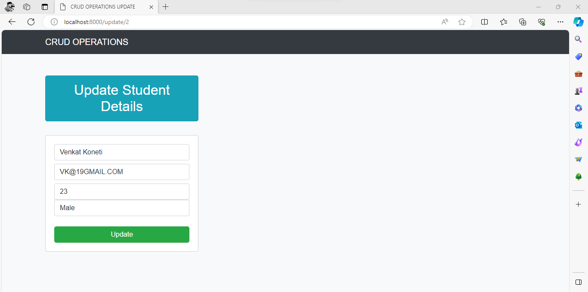

<Title>Crud Operations using django</Title>

This CRUD (Create, Read, Update, Delete) application page allows users to manage a list of candidates. On the left side, users can enter details of new candidates using the provided form and add them to the list. On the right side, the page showcases the total user data, providing options to edit or delete each candidate's information.

